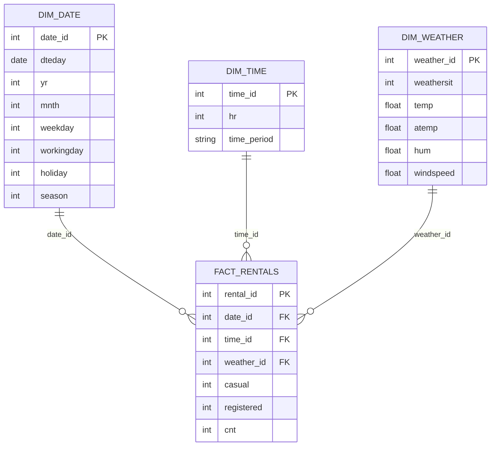

# Propuesta de Data Mart - Bike Sharing

## Esquema estrella

```mermaid
erDiagram
    DIM_DATE ||--o{ FACT_RENTALS : date_id
    DIM_TIME ||--o{ FACT_RENTALS : time_id
    DIM_WEATHER ||--o{ FACT_RENTALS : weather_id

    DIM_DATE {
        int date_id PK
        date dteday
        int yr
        int mnth
        int weekday
        int workingday
        int holiday
        int season
    }
    DIM_TIME {
        int time_id PK
        int hr
        string time_period
    }
    DIM_WEATHER {
        int weather_id PK
        int weathersit
        float temp
        float atemp
        float hum
        float windspeed
    }
    FACT_RENTALS {
        int rental_id PK
        int date_id FK
        int time_id FK
        int weather_id FK
        int casual
        int registered
        int cnt
    }
```

El archivo `data/processed/bike_sharing_datamart.db` contiene este Data Mart en SQLite.
